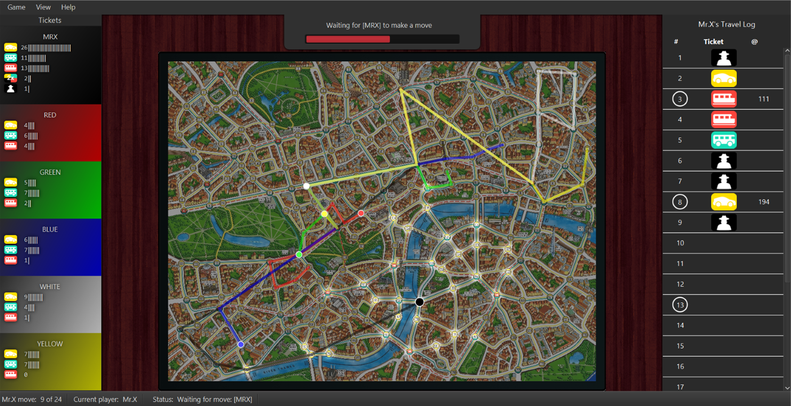

# ScotlandYard AI

Collection of AI algorithms used within scotland yard, can be used for both MrX, and Detectives.

## Features

- **Monte Carlo Tree Search**: Utilises Monte Carlo Tree Search, in MTCS.java to find the best moves for MrX to take.
- **Multi Threading**: Uses multi threading to speed up computation.
- **Min-Max trees**: A form of decision tree that is used in most of the AI's to pick the optimal move.
- **UltraFast**: An approximation of Min-Max Trees, that allow for greater look ahead and therefore better AI moves.

## Project Documentation

[Project Documentation](https://docs.google.com/document/d/10P0K3mW9pUqetGPaQNBEHKmPo4Igr67vwqyL1C7Fguk/edit?usp=sharing)

## Prerequisites

- **Java Runtime Environment (JRE)**: Ensure you have Java installed. You can download it from the [official Oracle website](https://www.oracle.com/java/technologies/downloads/).

## Impovements
Further improvements that can / will be made include:
- Benchmarking AI's, to provide definitive results.
- Utilising parralel processing on the GPU, using libaries such as Aparapi.

